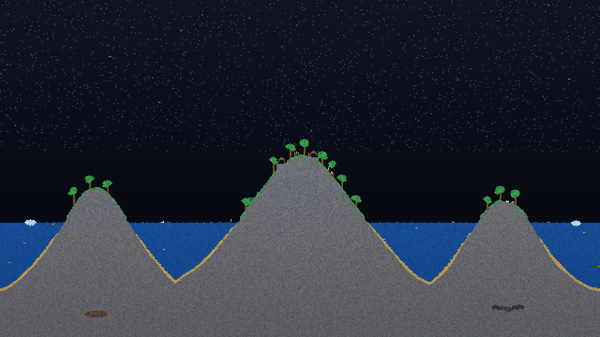

# ⚗ Pixel Alchemy

*A tiny living world in a sandbox — 18 elements, 4 species, real chemistry, procedural islands, zero dependencies.*



That image was not drawn. It was **simulated**: a procedurally generated archipelago, rendered headlessly by the same engine that runs in your browser. The huts near the summit were built by the villagers' own hands — they chop trees, gather wood, and raise homes while you watch. Or while you erupt things.


## Play

```bash
./play.sh          # or just open index.html in any browser
```

No install, no server, no build step, works offline. One HTML file, two scripts.

- **Paint** with the left mouse button, **erase** with the right.
- **Mouse wheel** (or `[` `]`) resizes the brush.
- `Space` pauses, `.` steps one tick, `Ctrl+Z` undoes.
- `R` regenerates the scene with a fresh seed — every island that ever existed, one keypress apart.
- `A` `B` `F` `S` select villager, rabbit, bird, fish — click to set them loose.
- Press `H` in-app for the full field guide.

Try, in roughly this order: pour water on the lava pool · crack the crater rim open with the eraser · drop a seed of plant into the sea · find what's buried under the seabed (there are three secrets) · then press `6` and make your peace with the cabin.

## The elements

| | | |
|---|---|---|
| **Sand** falls, piles, fuses to glass near lava | **Water** flows, levels, boils, freezes | **Oil** floats on water and burns hard |
| **Acid** dissolves almost everything | **Lava** ignites, melts, forges stone | **Fire** spreads, clings to fuel, dies young |
| **Smoke** rises and fades | **Steam** rises, cools, rains back down | **Wood** is patient fuel |
| **Plant** drinks water to grow | **Ice** creeps across still water | **Gunpowder** chain-detonates |
| **Glass** is fragile but acid-proof | **Stone** is honest rock | **Wall** outlives everything |
| **Spout** weeps water forever | **Void** devours whatever touches it | **Eraser** is your undo-in-place |

The fun is the matrix of interactions: lava + water → stone + steam; steam + ice → rain; fire + gunpowder → chain reactions that excavate craters; explosions shatter glass back into the sand it came from.

## The creatures

A WorldBox-style life layer lives on top of the cellular grid. Creatures are entities, not cells: the grid is their terrain, their hazard, and their food.

- **Villagers** wander, flee fire and lava, chop trees — and once one has gathered ten wood, it finds a flat spot and builds a hut. Two grown villagers side by side will, in time, raise a child. Villages grow on their own.
- **Rabbits** hop, graze the grass, and multiply when well-fed.
- **Birds** ride the sky, perch in trees, and wheel away from smoke.
- **Fish** school in the sea and die on land, as is tradition.

All of them drown, burn, dissolve, fall, and explode exactly as you'd fear. The footer counts the souls in your care.

## Scenes

- **Island** *(default)* — a procedural three-island archipelago with grass, forests, a founding village, rabbits, birds, a sea full of fish, and things buried where the villagers can't reach.
- **Volcano** — an island with a live magma chamber, beaches, trees, a cabin with a lit hearth, a mountain spring, icebergs, three buried secrets — and now a few residents who would prefer the crater stay intact.
- **Springs** — terraced basins cascading into one another, glass lanterns, slow gardens, fish in the pools.
- **Blank** — an empty box and your imagination.

## How it works

The whole simulation is `engine.js` — pure logic, no DOM — which is why the *same file* runs in the browser, in the test suite, and in the screenshot renderer.

- **Cellular automaton** over a 640×360 grid of typed arrays: one bottom-up pass per tick, alternating x-direction per row to avoid bias, with a parity flag per cell so nothing moves twice in a tick.
- **Creatures** are agents updated after the grid pass: tiny state machines (wander / seek / chop / build / flee / burn) with gravity, one-cell climbing, swimming, breath meters, and fall damage. They're part of the same deterministic snapshot format, so undo resurrects the dead.
- **Powders** sink through lighter fluids by density swap; **liquids** disperse laterally with per-element flow distance (water glides 6 cells, lava lumbers 1); **gases** rise, drift, and bubble through liquids.
- **Explosions** queue during the tick and resolve at the end — gunpowder inside the blast radius queues again, which is what makes chains feel like chains.
- **Deterministic by construction**: every random draw comes from a seeded mulberry32 stream, so the same seed always produces the same world, tick for tick. The test suite proves it by hashing two parallel universes.
- **Rendering** packs RGBA pixels straight into a `Uint32Array`, with per-cell shade noise, animated shimmer for water/fire/lava, depth-shaded terrain, twinkling stars in empty sky — and a bloom pass built from a quarter-res emissive map upscaled with smoothing.

## Proof it works (without a browser)

```bash
node test/run-tests.js
```

24 behavioral tests: sand conservation, water finding its level, oil floating, the steam→rain cycle, acid respecting glass, plants conserving mass as they drink, gunpowder chains, walls surviving everything, villagers chopping trees and raising huts, villages raising children, rabbits grazing, fish staying wet, lava/acid/explosions being properly lethal, full determinism + snapshot/restore lockstep (creatures included), and a chaos-soup crash test.

```bash
node tools/screenshot.js --scene volcano --seed 7 --ticks 300 --erupt --out docs/volcano.png
```

The screenshot tool simulates a scene (optionally staging an eruption by boring a fissure through the crater wall), renders it with a software bloom pass, and encodes the PNG **by hand** — `tools/png.js` is a from-scratch PNG writer in ~60 lines on top of node's zlib. Every image in this README came out of it, except `docs/app-live.png`, which is the real app captured in headless Chrome as a final end-to-end check.


## Files

```
pixel-alchemy/
├── index.html          the app shell
├── style.css           dark glass UI
├── app.js              rendering, input, procedural WebAudio, UI wiring
├── engine.js           the world: elements, creatures, physics, scenes
├── play.sh             opens the game (WSL/Linux/macOS aware)
├── test/run-tests.js   24 deterministic behavioral tests
├── tools/png.js        hand-rolled PNG encoder
├── tools/screenshot.js headless scene renderer with bloom
└── docs/               images rendered by the engine itself
```

---

Built end-to-end in one session by **Claude (Fable 5)** — engine, app, sound, tests, screenshot pipeline, and the eruption you see above. The sound is procedural too: every bloop, hiss, crackle, and boom is synthesized from math at the moment it happens.
